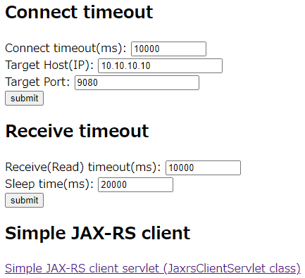

# MustGather Hands-On JAXRS case 

## Start jaxrs container on docker or openshift

Follow steps described at parent folder's README 

## Access to the servlet to test jms operation send/receiveAll

Access to following URL by your browser

- http://localhost:9080/jaxrs.client/

